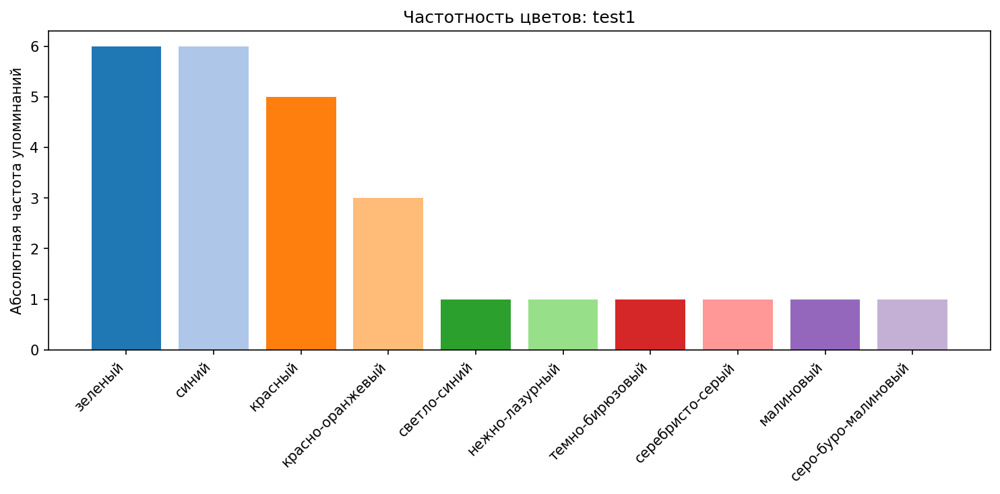
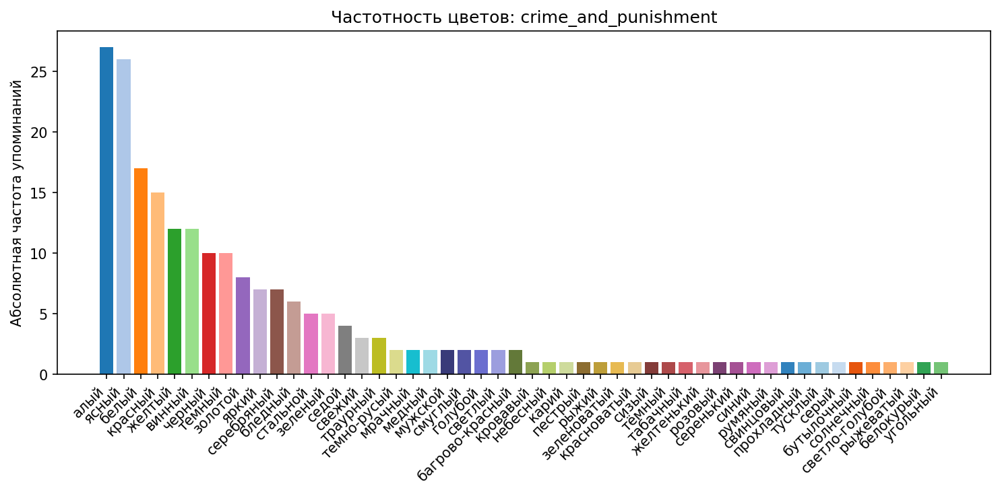
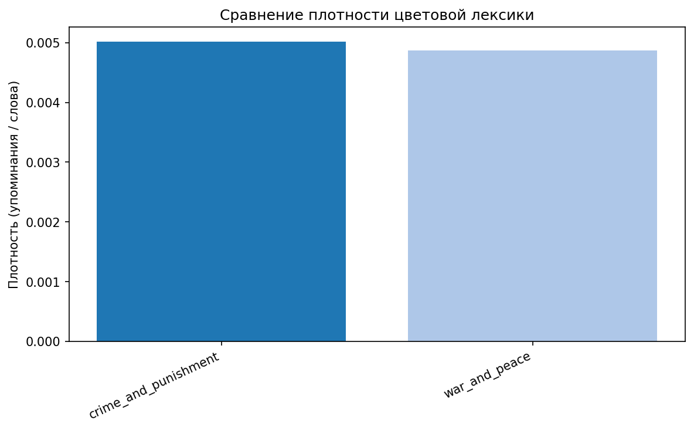
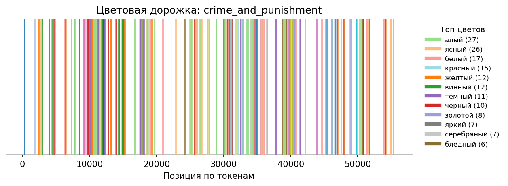
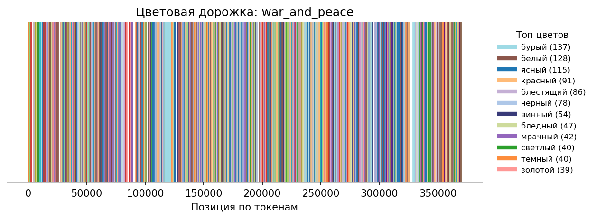

# Анализ неструктурированных данных. Вариант 7. "Окрашенность"
## Выполнила: Китова Екатерина Денисовна, 324 группа

## 1. Задача
Требовалось написать анализатор цветовой палитры текста. Данная программа выполняет лингвистический анализ русскоязычных текстов для оценки использования слов-названий цветов.

Также была сформулирована прикладная задача: "Отслеживание изменения настроения в художественных текстах по мере повествования"

Программа:
- Находит в тексте упоминания цветов: простых(красный, желтый и т.п.), так и сложных(светло-голубой, лимонно-желтый и т.п.)
- Строит статистику частоты употребления каждого цвета(относительно всех слов в тексте(плотность) и всех найденных цветов)
- Определяет наиболее часто встречающиеся цвета
- Вычисляет общие лингвистические характеристики текста(общее кол-во слов, уникальных слов, упоминание цветов, уникальность и плотность цветов )
- Поддерживает автоматическое распознавание сложных цветов, которых нет в словаре
- Строит графики частот по тексту и сравнительные графики по нескольким текстам
- Формирует сравнительную таблицу по нескольким текстам (через `pandas`) и сохраняет её в `CSV`
- Строит таймлайн-график и таблицу(через `pandas`) появления цветов относительно повествования текста(прикладная задача)

## 2. Требования и зависимости

*   **Язык программирования:** Python 3.9.7 и более поздние версии
*   **Необходимые библиотеки:**
    *   `natasha` - для морфологического анализа русского языка (лемматизация, определение частей речи)
    *   `nltk` - для стемминга (приведения слов к основе)
    *   `pandas` - для формирования сравнительных таблиц и экспорт в CSV
    *    `matplotlib`  - построение графиков
    *   `re` - для работы с регулярными выражениями при предобработке текста
    *   `collections` - для подсчета частотности слов
    *    `pathlib` - работа с файлами и папками

## 3. Инструкция по запуску

1.  Установите необходимые библиотеки:
    ```bash
    conda install natasha nltk pandas matplotlib
    ```

2. Запустите программу:
    ```bash
    python color_analyzer.py
    ```
    Далее выберите тип словаря:
    ```
    1 — По умолчанию
    2 — Свой словарь
    ```
   Если Выберите 2 тип, то на вход подаем путь к текстовому файлу, который имеет формат **`.txt`**, строго **UTF-8**, на русском языке. Можно указывать **относительный** (`dictionary.txt`) или **абсолютный** (`/home/user/dictionary.txt`)
    ```
    Выберите тип словаря:
    1 — По умолчанию
    2 — Свой словарь
    Введите номер типа: 2
    
    Введите путь к файлу-словарю: dictionary.txt
    Загружено 482 цветов из файла dictionary.txt
    Из них сложных цветов: 246
    Простых цветов: 236
    ```
3. Выберите тип режима работы:

4. 1) **Тестовый режим (один файл)**: На вход подаем  путь к текстовому файлу, который имеет формат **`.txt`**, строго **UTF-8**, на русском языке. Можно указывать **относительный** (`tests/test.txt`) или **абсолютный** (`/home/user/test.txt`)
    ```
    Выберите режим:
    1 — Тестовый (один файл)
    2 — Основной (несколько файлов)
    3 — Цветовая дорожка (один файл)
    Введите номер режима: 1
    Введите путь к файлу: tests/test1.txt
    ```
   2) **Основной режим (несколько файлов)**: На вход подаем  пути к текстовомым файлам через запятую, которые имеют формат **`.txt`**, строго **UTF-8**, на русском языке. Можно указывать **относительные** (`tests/test1.txt, tests/test2.txt `) или **абсолютные** (`/home/user/test1.txt, /home/user/test2.txt`)
   ```
    Выберите режим:
    1 — Тестовый (один файл)
    2 — Основной (несколько файлов)
    3 — Цветовая дорожка (один файл)
    Введите номер режима: 2
    Введите пути к файлам через запятую:
    Файлы: tests/test1.txt, tests/test2.txt, tests/test3.txt
    ```
   3) **Цветовая дорожка(один файл)**: На вход подаем  путь к текстовому файлу, который имеет формат **`.txt`**, строго **UTF-8**, на русском языке. Можно указывать **относительный** (`tests/test.txt`) или **абсолютный** (`/home/user/test.txt`)
   ```
    Выберите режим:
    1 — Тестовый (один файл)
    2 — Основной (несколько файлов)
    3 — Цветовая дорожка (один файл)
    Введите номер режима: 3
    Введите путь к файлу: tests/test1.txt
    ```
## 4. Работа с программой

### Ввод данных:
*   При запуске программа запросит путь(и) к текстовому файлу(ам) для анализа.
*   Можно ввести полный путь(и) к файлу(ам) или просто имя(имена) файла(ов), если он(и) находится(находятся) в той же папке.
*   Текстовый файл должен быть в кодировке UTF-8.

### Вывод данных:
* Подробная статистика:
	* *	Общее количество слов и уникальных лемм;
	* * Количество упоминаний цветов и их уникальность;
	* *	Плотность цветовой лексики;
	* *	Список сложных цветов (с пометкой (словарь) или (авто));
	* *	Таблица частотности (абсолютные и относительные значения).
* В режиме анализа нескольких файлов:
	* *	Формируется сравнительная таблица `figures/comparison_table.csv`;
	* *	Строится сравнительный график плотности `figures/comparison_density.png`;
	* *	Все индивидуальные графики частот сохраняются в подпапке `figures/`.
* В режиме построения цветовой дорожки(реализация для прикладной задачи):
	* *	Формируется таймлайн токенов в csv файл: `figures/timelime_tokens_<имя_файла.txt>.csv`;
	* *	Строится таймлайн график цветов `figures/timelime_<имя_файла.txt>.pnh`;

### Пример вывода программы:
* ***Для тестового режима***:
```  
Выберите тип словаря:
1 — По умолчанию
2 — Свой словарь
Введите номер типа: 1

Загружено 482 цветов из файла dictionary.txt
Из них сложных цветов: 246
Простых цветов: 236

Выберите режим:
1 — Тестовый (один файл)
2 — Основной (несколько файлов)
3 — Цветовая дорожка (один файл)
Введите номер режима: 1
Введите путь к файлу:  tests/test1.txt

============================================================
АНАЛИЗ ТЕКСТА: tests/test1.txt
============================================================

ОБЩАЯ СТАТИСТИКА ТЕКСТА:
Всего слов: 26
Уникальных слов(лемм): 10
Общее упоминание цветов: 26
Уникальных цветов: 10
Плотность цветов: 1.0000

СТАТИСТИКА ПО ЦВЕТАМ:
Самые частые цвета: зеленый, синий (6 упоминаний каждый)

СЛОЖНЫЕ ЦВЕТА (6):
  - красно-оранжевый (словарь): 3 упоминаний
  - нежно-лазурный (авто): 1 упоминаний
  - светло-синий (словарь): 1 упоминаний
  - серебристо-серый (словарь): 1 упоминаний
  - серо-буро-малиновый (авто): 1 упоминаний
  - темно-бирюзовый (авто): 1 упоминаний

ЧАСТОТНОСТЬ ЦВЕТОВ:
 ЦВЕТ                      АБСОЛ  ОТН(слов)  ОТН(цвет)
------------------------- ------ ---------- ----------
зеленый                        6     0.2308     0.2308
синий                          6     0.2308     0.2308
красный                        5     0.1923     0.1923
красно-оранжевый               3     0.1154     0.1154
светло-синий                   1     0.0385     0.0385
нежно-лазурный                 1     0.0385     0.0385 (авто)
темно-бирюзовый                1     0.0385     0.0385 (авто)
серебристо-серый               1     0.0385     0.0385
малиновый                      1     0.0385     0.0385
серо-буро-малиновый            1     0.0385     0.0385 (авто)
------------------------- ------ ---------- ----------
ВСЕГО ЦВЕТОВ:                 26
Список уникальных цветов сохранён: figures/colors_raw_test1.txt
Частоты цветов сохранены: figures/colors_freq_test1.csv
График сохранён: figures/freq_test1.png
```
* ***Для основного режима***:
```
Выберите тип словаря:
1 — По умолчанию
2 — Свой словарь
Введите номер типа: 1

Загружено 482 цветов из файла dictionary.txt
Из них сложных цветов: 246
Простых цветов: 236

Выберите режим:
1 — Тестовый (один файл)
2 — Основной (несколько файлов)
3 — Цветовая дорожка (один файл)
Введите номер режима: 2
Введите пути к файлам через запятую
Файлы: tests/test1.txt, tests/test2.txt

============================================================
АНАЛИЗ ТЕКСТА: tests/test1.txt
============================================================

ОБЩАЯ СТАТИСТИКА ТЕКСТА:
Всего слов: 26
Уникальных слов(лемм): 10
Общее упоминание цветов: 26
Уникальных цветов: 10
Плотность цветов: 1.0000

СТАТИСТИКА ПО ЦВЕТАМ:
Самые частые цвета: зеленый, синий (6 упоминаний каждый)

СЛОЖНЫЕ ЦВЕТА (6):
  - красно-оранжевый (словарь): 3 упоминаний
  - нежно-лазурный (авто): 1 упоминаний
  - светло-синий (словарь): 1 упоминаний
  - серебристо-серый (словарь): 1 упоминаний
  - серо-буро-малиновый (авто): 1 упоминаний
  - темно-бирюзовый (авто): 1 упоминаний

ЧАСТОТНОСТЬ ЦВЕТОВ:
 ЦВЕТ                      АБСОЛ  ОТН(слов)  ОТН(цвет)
------------------------- ------ ---------- ----------
зеленый                        6     0.2308     0.2308
синий                          6     0.2308     0.2308
красный                        5     0.1923     0.1923
красно-оранжевый               3     0.1154     0.1154
светло-синий                   1     0.0385     0.0385
нежно-лазурный                 1     0.0385     0.0385 (авто)
темно-бирюзовый                1     0.0385     0.0385 (авто)
серебристо-серый               1     0.0385     0.0385
малиновый                      1     0.0385     0.0385
серо-буро-малиновый            1     0.0385     0.0385 (авто)
------------------------- ------ ---------- ----------
ВСЕГО ЦВЕТОВ:                 26
Список уникальных цветов сохранён: figures/colors_raw_test1.txt
Частоты цветов сохранены: figures/colors_freq_test1.csv
График сохранён: figures/freq_test1.png

============================================================
АНАЛИЗ ТЕКСТА: tests/test2.txt
============================================================

ОБЩАЯ СТАТИСТИКА ТЕКСТА:
Всего слов: 22
Уникальных слов(лемм): 20
Общее упоминание цветов: 1
Уникальных цветов: 1
Плотность цветов: 0.0455

СТАТИСТИКА ПО ЦВЕТАМ:
Самый частый цвет: 'зеленый' (1 упоминаний)

СЛОЖНЫЕ ЦВЕТА (0):
Не найдено

ЧАСТОТНОСТЬ ЦВЕТОВ:
 ЦВЕТ                      АБСОЛ  ОТН(слов)  ОТН(цвет)
------------------------- ------ ---------- ----------
зеленый                        1     0.0455     1.0000
------------------------- ------ ---------- ----------
ВСЕГО ЦВЕТОВ:                  1
Список уникальных цветов сохранён: figures/colors_raw_test2.txt
Частоты цветов сохранены: figures/colors_freq_test2.csv
График сохранён: figures/freq_test2.png

============================================================
СРАВНИТЕЛЬНАЯ ТАБЛИЦА:
============================================================
          Текст  Слова  Уник. слова  Упомин. цветов  Уник. цветов  Плотность    Топ-цвет(а)
tests/test1.txt     26           10              26            10     1.0000 зеленый, синий
tests/test2.txt     22           20               1             1     0.0455        зеленый
CSV со сравнительной таблицей сохранён: figures/comparison_table.csv
График сравнений сохранён: figures/comparison_density.png

```
* ***Для цветовой дорожки***:
```

Выберите тип словаря:
1 — По умолчанию
2 — Свой словарь
Введите номер типа: 1

Загружено 482 цветов из файла dictionary.txt
Из них сложных цветов: 246
Простых цветов: 236

Выберите режим:
1 — Тестовый (один файл)
2 — Основной (несколько файлов)
3 — Цветовая дорожка (один файл)
Введите номер режима: 3
Введите путь к файлу: tests/test1.txt

============================================================
ЦВЕТОВАЯ ДОРОЖКА: tests/test1.txt
============================================================
 Позиция(токен)                Цвет
              0    красно-оранжевый
              2    красно-оранжевый
              4    красно-оранжевый
              6        светло-синий
              8             зеленый
             10             зеленый
             12             зеленый
             14             зеленый
             16             зеленый
             18             зеленый
             20             красный
             22             красный
             24             красный
             26             красный
             28             красный
             30               синий
             32               синий
             34               синий
             36               синий
             38               синий
             40               синий
             42      нежно-лазурный
             44     темно-бирюзовый
             46    серебристо-серый
             48           малиновый
             49 серо-буро-малиновый
CSV-дорожка сохранёна: figures/timeline_tokens_test1.csv
График цветовой дорожки сохранён: figures/timeline_test1.png
```
## 5. Файлы проекта

*   `color_analyzer.py` - основной исполняемый файл 
*   `dictionary.txt` - базовый файл словаря цветов(с сайта: https://textometr.ru/colors)
*   `tests/` - папка с тестовыми текстами
* *   `test1.txt` - тест, состоящий только из цветов: простые и сложные, из словаря и нет, в разных словоформах и регистрах
* *   `test2.txt` - тест, имеющий глагол, содержащий в себе корень цвета, программа не должна его считать за цвет, также можно легко проверить подсчет слов и уникальных лемм
* *   `test2_1.txt` - простой тест Ани Ф. для сравнения программ в презентации
* *`test3.txt` - тест, содержащий сложные составные цвета(серо-буро-малиновый, красно-оранжево-желтые и т.п.) -- слоформы не из словаря
* * `test4.txt` - тест, в котором есть другие слова помимо цветов(стандартная проверка работоспособности)
* * `bunin_temnye_all.txt ` - большой тест Ани Ф. для сравнения программ в презентации
* *    `crime_and_punishment.txt ` - тест, содержащий ознакомительный фрагмент Ф. М. Достоевского "Преступление и наказание", проверка на больших художественных текстах(для сравнения больших текстов и построения таймлайна)
* * `war_and_peace.txt ` - тест, содержащий первую полную версию Л.Н. Толстого "Война и мир", проверка на больших художественных текстах(для сравнения больших текстов и построения таймлайна)
* `figures/` — автоматически создаваемая папка для графиков, таблиц и словарей текстов
* `README.md` - данный файл с описанием
* `АНД_Варианты_ДЗ_2025.pdf` - файл с формулировками вариантов заданий
* `окрашенность_анд.pdf` - файл с презентацией
* `Отчёт.pdf` - файл с отчетом о проделанной работе и содержательным анализом результатов

## 6. Понятия простых и сложных цветов в программе
* **Простые цвета** - это отдельные слова, обозначающие один цвет, без дефисов и дополнительных частей
Примеры: красный, синий, желтый, зеленый, белый, черный, розовый, бирюзовый, серый.
* *	всегда присутствуют в словаре `dictionary.txt`;
* * могут иметь различные формы в тексте (например, желтый, желтые, желтым);
* *	программа приводит их к лемме (начальной форме) перед подсчётом.
* **Cложные цвета** - это составные прилагательные, образованные через дефис из двух или более цветовых основ.
Они делятся на две группы:
* * 1) **Сложные из словаря**: cоставные цвета, внесённые в словарь `dictionary.txt` в готовом виде: светло-голубой, темно-синий, лимонно-желтый, серебристо-серый и подобные.
Если программа встречает их в тексте (в любой форме), они распознаются напрямую как известные цвета.
* * 2) **Автоматически определяемые сложные цвета**: конструкции с двумя и более дефисами, которых нет в словаре, но последняя часть является простым цветом из словаря. Программа определяет такие слова как цвета автоматически.
Например: в словаре нет `нежно-лазурный`, но есть `лазурный`. Тогда программа будет искать в словаре простых цветов лемму от `лазурный`, тогда программа определит `нежно-лазурный` как сложный цвет

## 7. Алгоритм
### **Загрузка словаря(`_load_color_dictionary_from_file`)**
Программа считывает файл `dictionary.txt`(если не предложен другой словарь), содержащий список всех известных названий цветов.  
- Каждое слово переводится в нижний регистр и классифицируется:
  - если слово содержит **дефис** — оно считается **сложным цветом**;
  - если дефиса нет — **простым**.
- Для простых цветов дополнительно сохраняются **основы (стемы)** и **леммы** для последующего сопоставления.

### **Предобработка текста(`preprocess_text`)**
- Введённый текст очищается от лишних пробелов и переводится в нижний регистр.  
- Программа нормализует формат, чтобы морфологический анализатор корректно обработал все слова.

### **Морфологический анализ(`morphological_analysis`)**
- С помощью библиотеки **Natasha** текст разбивается на токены (слова, знаки пунктуации и т.д.).  
- Для каждого токена определяются:
  - **лемма** — начальная форма слова;
  - **часть речи (POS)**;
  - **основа слова (stem)** — с помощью `nltk.SnowballStemmer`.  
- Это необходимо, чтобы программа могла распознавать цвета независимо от падежа, рода или числа  
  *(например: «желтая», «желтым», «желтые» => «желтый»).*

### **Определение цветов(`extract_colors`)**
Для каждого токена выполняется последовательная проверка:

1. **Проверка по лемме:**  
   если лемма полностью совпадает со словом из словаря — это цвет.

2. **Проверка по тексту токена:**  
   если слово в исходной форме совпадает со словарным цветом — оно засчитывается.

3. **Проверка по основе (стему):**  
   если стем слова совпадает с основой цвета из словаря — засчитывается цвет.

4. **Проверка на сложные цвета:**  
   - если токен содержит **один дефис** и не найден в словаре — проверяется, является ли его **вторая часть** простым цветом;  
   - если токен содержит **два и более дефиса**, и в словаре нет точного совпадения — программа берёт **последнюю часть**, лемматизирует её и ищет в списке простых цветов.  
     Если совпадение найдено, программа восстанавливает цвет в форме `префикс–лемма`, например:  
     `бело-сине-голубые` => `бело-сине-голубой`.  
     Такой цвет помечается как **(авто)**.

### **Подсчёт статистики(`calculate_statistics`)**
После извлечения всех упоминаний цветов программа вычисляет:
- **общее количество слов** (исключая пунктуацию)
- **количество уникальных лемм**
- **общее число упоминаний цветов** и их разнообразие
- **плотность цветовой лексики** — долю слов, обозначающих цвета
- **частоты употребления** (абсолютные и относительные — по словам и по всем цветам)
- **наиболее часто встречающийся цвет(а)**, теперь программа выводит **все цвета**, встречающиеся максимальное количество раз (если их несколько, а не только один)

В словаре статистики сохраняются:
- `most_common_colors` — список всех наиболее частотных цветов;
- `most_common_count` — количество упоминаний для каждого из них.

### **Графики, файлы и таблицы (`plot_color_frequency`, `_print_comparison_table`, `plot_comparison`, `_save_colors_outputs`, `plot_comparison`)**
- `plot_color_frequency` — строит и сохраняет бар-чарт частот цветов для одного текста в подпапку `figures/`
- `_print_comparison_table` — формирует сравнительную таблицу по нескольким текстам (через pandas) и сохраняет её в `figures/comparison_table.csv`
- `plot_comparison` — строит и сохраняет сравнительный график плотности цветовой лексики по наборам текстов `figures/comparison_density.png`
- 	`_save_colors_outputs` — создаёт два текстовых файла в подпапке `figures/`:
- - `colors_raw_<имя_файла>.txt `— список уникальных найденных цветов (по одному в строке)
- - `colors_freq_<имя_файла>.csv` — таблица частот (абсолютных и относительных) с колонками:
	1)	«Цвет»
	2)	«Абсолютная частота»
	3)	«Относит. к словам»
	4)	«Относит. к цветам»

#### **Примеры графиков:**






> И да, это нормально, что написано "зеленый", но колонка синяя. Хотелось просто в разные цвета покрасить :)
### Реализация для прикладной задачи/Цветовая дорожка(`extract_colors_with_positions`,` plot_color_timeline`)
Визуализирует «настроение» текста по мере чтения: вертикальные цветные штрихи в позициях, где встречаются цвета.
- `extract_colors_with_positions` — извлекает пары (позиция_токена, цвет).
- ` plot_color_timeline` — строит таймлайн(график-дорожку), подписывает ось токенов, рисует легенду топовых цветов (с абсолютными частотами) справа.
Сохраняет:
-  `figures/timeline_<имя_файла>.png` — картинка дорожки,
-  `figures/timeline_tokens_<имя_файла>.csv` — «легенда по токенам» с колонками: «Позиция(токен)», «Цвет», и печатает её на экран

Также были построенны дополнительные функции, чтобы увеличить палитру цветов: `_get_color_map_for_labels` => `_make_huge_palette` => `_combined_cmap_colors` /` _sample_from_continuous `

#### **Пример таймлайна:**


### **Вывод результатов(`print_results`)**
На экран выводится:
- общая статистика текста (количество слов, уникальных лемм, плотность цветов);
- **все наиболее частотные цвета**, если встречаются несколько с одинаковой частотой;
- таблица частотности (абсолютные и относительные значения);
- список всех найденных сложных цветов с указанием источника их распознавания:
  - *(словарь)* — если цвет найден напрямую в `dictionary.txt`
  - *(авто)* — если сложный цвет построен автоматически по алгоритму
- при отсутствии цветов программа сообщает, что ни одного упоминания не найдено

### **Режимы анализа(`analyze_text`, `analyze_multiple_texts`,`analyze_timeline`)**
- `analyze_text` — полный анализ одного текста
- `analyze_multiple_texts` — пакетный анализ нескольких файлов:
* * запускает `analyze_text` для каждого пути
* * сохраняет индивидуальные графики частот `freq_<имя_файла.txt>.png`
* * строит и сохраняет общую сравнительную таблицу и график плотности
- `analyze_timeline` — прикладная задача, строит «цветовую дорожку» для одного файла:
* * выводит на экран CSV с позициями и цветами
* * сохраняет `timeline_<имя>.png `и `timeline_tokens_<имя>.csv`
> Весь код, который закомментирован, использовался для отладки

## 8. Особенности работы программы
*   Ищет дубли в словаре (по умолчанию) `dictionary.txt` и заносит в массив только уникальные цвета
*   Выполняет морфологический анализ с помощью библиотеки `Natasha`
*   Автоматически распознает сложные цвета, даже если их нет в словаре, при выводе отмечается
как `(авто)`
*   Игнорирует пунктуацию при подсчете общего количества слов
*   Вычисляет относительную частоту как относительно всех слов, так и относительно всех найденных цветов
*   Cтроит и сохраняет графики, цветовую дорожку, таблицы и файлы-словари

## 9. Результаты
Программа прошла все написанные мной тесты: хорошо определялись цвета(и сложные, и простые) из словаря `dictionary.txt`, правильно подсчитывались абсолютные и относительные частоты и слова в тексте.

Хорошо себя показало автоматическое определение сложных цветов, которые имеют лемму простого цвета в словаре, но сложную форму - нет, определяя даже более сложные цвета вида `[цвет]-[цвет]-[цвет]`/ `[лемма]-[лемма]-[цвет]`, т.е. более двух дефисов.

Также тесты, которые были приложены для прикладной задачи, `crime_and_punishment.txt `и `war_and_peace.txt` показали хорошую работу на всех режимах. Правда, `war_and_peace.txt` работает примерно 5 минуты, так как текст объемный :)

#### **Пример работы режима 3 на `war_and_peace.txt`**
```
Выберите тип словаря:
1 — По умолчанию
2 — Свой словарь
Введите номер типа: 1

Загружено 482 цветов из файла dictionary.txt
Из них сложных цветов: 246
Простых цветов: 236

Выберите режим:
1 — Тестовый (один файл)
2 — Основной (несколько файлов)
3 — Цветовая дорожка (один файл)
Введите номер режима: 3
Введите путь к файлу: tests/war_and_peace.txt

============================================================
ЦВЕТОВАЯ ДОРОЖКА: tests/war_and_peace.txt
============================================================
 Позиция(токен)             Цвет
            458            ясный
            564            ясный
            637            ясный
            752           черный
            873             алый
           1765          красный
           1846          светлый
           1919            седой
           2578           свежий
           4629          золотой
           4712          мрачный
           4748          светлый
           4751        блестящий
           4752            белый
           4798       серебряный
           4887        серенький
           5033          светлый
           5044       коричневый
           5622        блестящий
           5700          румяный
           6067         зеленный
           6127            белый
           6731    темно-зеленый
           7047       монотонный
           7889       коричневый
           8120            белый
           8532            белый
           8547            белый
           8806          светлый
           9800          золотой
          10440          красный
          10442            синий
          11735            бурый
          12399           винный
          12492           черный
          12557            ясный
          13825           свежий
          14084            белый
          15203           свежий
          15527        блестящий
          16369       коричневый
          16574            ясный
          16790     коричневатый
          16813            яркий
          17306            яркий
          17393         багровый
          17819            белый
          18082           винный
          18127            ясный
          18284          красный
          18287          красный
          18452            белый
          18454          румяный
          18478           свежий
          18482            русый
          18486           черный
          18496           свежий
          18508           черный
          18548          красный
          18601           винный
          18618            белый
          18733            белый
          19145          светлый
          19146          голубой
          19244         огненный
          19339          светлый
          19524            белый
          20067          светлый
          20072            белый
          20167          бледный
          20170          красный
          20510          бледный
          21245            седой
          21271        мраморный
          21348           винный
          21395          золотой
          22502          мужской
          22561        малиновый
          22572          румяный
          22717           черный
          22841           черный
          22866           свежий
          22873           черный
          22951          мрачный
          23249        белокурый
          23266            серый
          23298           свежий
          23329            русый
          23344            карий
          23359           черный
          23832           черный
          23842       желтоватый
          24437            белый
          25844            белый
          27764          красный
          28222        бронзовый
          28699       монотонный
          29603          румяный
          30538            ясный
          31574            седой
          31877          золотой
          32453           свежий
          32455          розовый
          32473          розовый
          33190        блестящий
          33340          мрачный
          33344            белый
          33707            седой
          34276            седой
          34317          мужской
          34372          голубой
          34378           винный
          34417            седой
          34428          мужской
          34584           винный
          34902           винный
          34946           винный
          34959           винный
          35196          мужской
          36005          мужской
          36061        блестящий
          36236        сливочный
          36241        морковный
          36392          красный
          36998          мрачный
          37373          розовый
          37400     коричневатый
          37522            синий
          38333           лунный
          38378           лунный
          38406          золотой
          38678          мрачный
          39040          мрачный
          39811          мужской
          40786           свежий
          40896            ясный
          40950            белый
          41164            серый
          41431          тусклый
          41886            ясный
          42406           черный
          43966          бледный
          44762          бледный
          44868          красный
          44885          красный
          44887            яркий
          44914     снежно-белый
          44929            яркий
          44930          зеленый
          44944            седой
          44965    красно-желтый
          45003         восковой
          45027        блестящий
          45206          мужской
          45297          румяный
          45466            белый
          45473          зеленый
          45721    красно-желтый
          45725            седой
          45870            седой
          46012          зеленый
          46783       зеркальный
          46808            яркий
          47657          бледный
          47737          бледный
          47896           темный
          48356            бурый
          48700            серый
          48720        блестящий
          48851        мраморный
          48916           свежий
          49073          красный
          49105       желтоватый
          49236         табачный
          49270        блестящий
          49274          красный
          49276   переливающийся
          49306            ясный
          49874          голубой
          50320           свежий
          50773            бурый
          51863            бурый
          52034            седой
          52104            седой
          52366        белокурый
          52370            бурый
          52404            бурый
          52524            бурый
          52613            бурый
          52705            бурый
          52839          румяный
          53463       серебряный
          53469          золотой
          53939            белый
          53941            белый
          54117           свежий
          54136            бурый
          54306          золотой
          54521        блестящий
          54821            ясный
          55578            бурый
          55778       серебряный
          56177          розовый
          56342            бурый
          56353            бурый
          56736            ясный
          57173           черный
          57177       серебряный
          57181       серебряный
          57278     коричневатый
          57393          красный
          57709            бурый
          57781           винный
          57919          румяный
          58023            бурый
          58069            белый
          58942            белый
          59076            бурый
          59143            белый
          59396            ясный
          59607           винный
          59678          золотой
          60401            серый
          60403           черный
          60532          красный
          60952        синеватый
          60975          светлый
          60986            синий
          61189          голубой
          61211           черный
          61214            белый
          61325            белый
          61680       черноватый
          61820          красный
          61825            синий
          62013          красный
          62158            серый
          62172        белокурый
          62174            ясный
          62175          голубой
          62296          голубой
          62362           винный
          63131            белый
          63896            ясный
          65458           черный
          65536          мрачный
          66200        бронзовый
          66747            белый
          68061        загорелый
          68477           винный
          68763           черный
          68770          красный
          68773        блестящий
          68774           черный
          68850            карий
          68859           черный
          68883           черный
          68908           винный
          69271          золотой
          69305          золотой
          69600          золотой
          70002            белый
          70152          мрачный
          71152            белый
          71158          золотой
          71177          золотой
          71582          бледный
          71584            серый
          71629            серый
          71833  пунцово-красный
          72096          мрачный
          73180            ясный
          73195            белый
          73198          красный
          73249          зеленый
          73673    молочно-белый
          73904    металлический
          73988            яркий
          74186           мутный
          74268            белый
          74400          мрачный
          74641          пестрый
          74661  багрово-румяный
          75125          красный
          75127           черный
          75172           черный
          75193          красный
          75230            белый
          75526       прозрачный
          75836            синий
          75908            яркий
          75915           темный
          75964            ясный
          76246            синий
          76350            ясный
          76352          светлый
          76481          красный
          76558          бледный
          76635           черный
          76924        белокурый
          76927          красный
          77101          мрачный
          77988           желтый
          77991    темно-зеленый
          77998            синий
          78013            синий
          78076            яркий
          78092            синий
          78677          голубой
          78684            яркий
          79876           темный
          80018           темный
          80022            яркий
          80090          бледный
          80176          золотой
          80241           темный
          80651            седой
          80656         восковой
          82076        блестящий
          82681        блестящий
          83580            белый
          83816           свежий
          84651          золотой
          86414            белый
          86918            серый
          87058           свежий
          87636          мрачный
          87778          золотой
          88910           винный
          89193          мрачный
          91775           свежий
          91796            белый
          91811          красный
          93216            карий
          93624            ясный
          94390          бледный
          94722            белый
          94787            карий
          94795           мутный
          95436            рыжий
          95806          тусклый
          96260           свежий
          96351            серый
          96504            карий
          97589        блестящий
          97728            ясный
          97732          красный
          97739            ясный
          98416  красно-багровый
          98541            ясный
          99010            карий
          99084            карий
          99109           темный
          99663            синий
          99666           черный
          99668        загорелый
         100003          бледный
         100642         багровый
         100920        синеватый
         100954          красный
         100956          голубой
         102693           черный
         102709           темный
         102713            ясный
         102894          бледный
         103026          бледный
         103148           темный
         103315          мрачный
         103339            ясный
         103378            белый
         103535   горячо-красный
         103641            бурый
         103645          мрачный
         103782          бледный
         104018          золотой
         104039            синий
         104143          золотой
         104804            карий
         105161           винный
         105527          красный
         105644            белый
         105787           черный
         105831           желтый
         105928          светлый
         106497            ясный
         106911            ясный
         108006          розовый
         108151           свежий
         108243        блестящий
         108417        блестящий
         108621            ясный
         108787        мраморный
         108876        мраморный
         108937           черный
         110423            ясный
         110903            яркий
         110905         восковой
         110917          золотой
         110927          красный
         111450           винный
         111480           винный
         111499          мрачный
         111662        мраморный
         111684          красный
         112808        блестящий
         113169          красный
         113895            бурый
         113911            бурый
         113938          бледный
         113967            бурый
         114063            бурый
         114111            бурый
         114195            бурый
         114265            бурый
         114299            бурый
         114305            белый
         114350            бурый
         114443            бурый
         114707           винный
         115031            бурый
         115087            бурый
         115150          зеленый
         115202            бурый
         115267            белый
         115419            бурый
         115513          светлый
         115537            бурый
         115550          голубой
         115560          голубой
         115563       коричневый
         115640          голубой
         115711        серенький
         115730        серенький
         115737            бурый
         115803            бурый
         115843            бурый
         115901            ясный
         115946            бурый
         116149            ясный
         116269           черный
         116560            бурый
         116576            бурый
         116648            бурый
         116661            бурый
         116695            яркий
         116772            белый
         116780            русый
         117217            бурый
         117464            бурый
         117509            бурый
         117963            бурый
         117973            бурый
         118387            бурый
         118844        солнечный
         119060            бурый
         119113            бурый
         119157            бурый
         119212            бурый
         119241            бурый
         119359            бурый
         119405            бурый
         119487            бурый
         119500            бурый
         119625            бурый
         119643            бурый
         119679            бурый
         119818           темный
         119835            белый
         119838           черный
         119841          румяный
         119856            бурый
         120224            бурый
         120257            бурый
         120442            бурый
         120489            бурый
         120949            бурый
         120952            бурый
         121163            бурый
         121210            бурый
         121253            бурый
         121292            бурый
         121398            бурый
         121401            бурый
         121438            бурый
         121454            бурый
         122811           темный
         124647           черный
         124650        загорелый
         125170           черный
         125267           черный
         125372           винный
         125407           винный
         125595            ясный
         127401           винный
         127420           винный
         127790           черный
         128206        блестящий
         128235          мрачный
         128369           винный
         128567           винный
         129171            бурый
         129174            карий
         130386           свежий
         130479            синий
         130481          красный
         130483          зеленый
         130495            рыжий
         130497            серый
         130505           медный
         130513        блестящий
         130696        блестящий
         130697            белый
         130722            белый
         131291            белый
         131813          красный
         131989            ясный
         132031         багровый
         132152         багровый
         132435         багровый
         133082           винный
         133388           маркий
         133425           маркий
         133448           маркий
         133452           маркий
         133832       черноватый
         133833           желтый
         133939            ясный
         134602        блестящий
         134617            ясный
         134619        солнечный
         134846          красный
         135096            белый
         135225          светлый
         135442          голубой
         135454          светлый
         135542        блестящий
         135656          золотой
         136066            седой
         137677        блестящий
         137846           винный
         138409        белокурый
         138454        блестящий
         138471          румяный
         138576          золотой
         139345           темный
         139470            яркий
         139664             алый
         139781             алый
         140285           черный
         140298            белый
         140322            белый
         140332            белый
         140408           черный
         140702            яркий
         140703          красный
         140766            белый
         141548            серый
         141575           черный
         142278           темный
         142309           темный
         142369           темный
         142988             алый
         143540          светлый
         143545            ясный
         143546          голубой
         143555         багровый
         143562         молочный
         143632            серый
         143660            яркий
         143809            ясный
         143874           свежий
         143992            белый
         144280    молочно-белый
         144305           темный
         144306            ясный
         144320         багровый
         144636          зеленый
         144639            белый
         144966           черный
         144969            белый
         144973            рыжий
         144978            белый
         145057            ясный
         145107            серый
         145205           свежий
         145216          румяный
         145262            белый
         145334           свежий
         145353        блестящий
         145371        блестящий
         145804        блестящий
         146183            яркий
         146441        блестящий
         146457            синий
         146711          красный
         147219          бледный
         147309            ясный
         147564          мрачный
         148283            яркий
         148304            рыжий
         148516            серый
         148649        блестящий
         149039            белый
         149043        блестящий
         149044          золотой
         149284        блестящий
         149375            белый
         149644            ясный
         149691           свежий
         149911            серый
         149916            белый
         150005          красный
         150037          мрачный
         150095            серый
         150175          красный
         150181        блестящий
         150209        блестящий
         150709          мрачный
         150713            ясный
         150714        солнечный
         150947          бледный
         151513            ясный
         151614            белый
         151633            рыжий
         151678            белый
         151761          бледный
         152832           винный
         152899       серебряный
         152926            синий
         152935            белый
         153131             алый
         153457            серый
         153474            серый
         153607          красный
         154157            белый
         154703          золотой
         154749          золотой
         154790            ясный
         155485           темный
         155528            бурый
         155672        блестящий
         155689          красный
         156086           свежий
         156091           свежий
         156102          розовый
         156106           черный
         156109            белый
         156599          красный
         158240           маркий
         158329            ясный
         158704         весенний
         159461       серебряный
         160614          светлый
         161102          светлый
         161110          голубой
         161717          медовый
         161908        блестящий
         162205            яркий
         162699            белый
         162733        мраморный
         163067          красный
         163132        мраморный
         163838          бледный
         164896          бледный
         164902          бледный
         165066            белый
         165779            белый
         166010          бледный
         166087            белый
         166140            белый
         166149           черный
         166159          румяный
         166175        блестящий
         166408          бледный
         166497           черный
         166538          красный
         166540            белый
         166552           темный
         166679           винный
         167187          бледный
         167317            ясный
         167766         небесный
         167808            яркий
         167809          голубой
         168338        блестящий
         168916          светлый
         169324          красный
         169640          красный
         170206          мужской
         170211          золотой
         170224            яркий
         170258            ясный
         170468         стальной
         171696          красный
         172451         восковой
         172463       серебряный
         172573            ясный
         173753        блестящий
         174847            белый
         174849            седой
         176240        блестящий
         176560         багровый
         176709          мрачный
         177650            ясный
         178748           желтый
         180041           темный
         180046            ясный
         180072            ясный
         180481        блестящий
         180989           желтый
         181408            ясный
         181766         ядовитый
         182008         телесный
         182500        кирпичный
         182947            белый
         183000         угольный
         183746         багровый
         185145          мрачный
         185834          мрачный
         186706            ясный
         186872          красный
         187188            бурый
         187306        мраморный
         187742            ясный
         188316           черный
         189155          красный
         189872            синий
         190337          румяный
         190408           темный
         190433          матовый
         190528          матовый
         190683           мутный
         190986          румяный
         191216            серый
         191231          красный
         192432            яркий
         192521           черный
         192731          голубой
         192733            ясный
         192807           черный
         192826          мужской
         192875          мужской
         193264          румяный
         193560        блестящий
         193973         зеленный
         193984         зеленный
         194214         весенний
         194793           винный
         195175           желтый
         195718          красный
         195738           черный
         197561            белый
         198321        блестящий
         199343            седой
         199623          мрачный
         199649          бледный
         199808             алый
         200078        рыжеватый
         200376           свежий
         201201          светлый
         201261          светлый
         201315        рыжеватый
         201318          красный
         201915       серебряный
         202022          румяный
         202113          мрачный
         203350         весенний
         203356          мрачный
         203494           темный
         203496         зеленный
         203575          золотой
         203968            ясный
         204259           темный
         204310    желто-бледный
         204780        блестящий
         204784          румяный
         204826             алый
         205172            ясный
         205456             алый
         205687           черный
         205712          мужской
         205750            ясный
         206319            белый
         206350        мраморный
         206364          румяный
         206906           винный
         208368          золотой
         208384        блестящий
         208628           темный
         209557            бурый
         209939           лунный
         210030            белый
         210201          розовый
         210349        загорелый
         211409        блестящий
         211415          красный
         211444        блестящий
         211758            белый
         212061            седой
         212117          красный
         212565          красный
         213219            серый
         213221          светлый
         213226            синий
         213228      темно-синий
         213230          красный
         214319            ясный
         214463          бледный
         214514       черноватый
         215474          золотой
         215524        белокурый
         215531            синий
         215645            белый
         216201            белый
         216295            ясный
         217084            ясный
         217153            белый
         218132            белый
         218316            белый
         218339           винный
         219275            ясный
         219330          мужской
         219431        блестящий
         219650             алый
         219665        блестящий
         219896            синий
         220328            седой
         220334         огненный
         221336          светлый
         221817           темный
         221974           темный
         222133            ясный
         222182            серый
         222188            серый
         222191         огненный
         222199         огненный
         223570       прозрачный
         223574       прозрачный
         224105        блестящий
         224862          красный
         224937        блестящий
         225012          красный
         225184            белый
         225390            белый
         225670            синий
         225907           желтый
         226058          красный
         226199            белый
         226201          голубой
         226286            белый
         226293           черный
         226340          золотой
         226460       серебряный
         227006        блестящий
         227613        блестящий
         227678        блестящий
         228063           винный
         228239          мрачный
         228454            синий
         228515            белый
         228740        блестящий
         228768           свежий
         229320            синий
         229586         телесный
         229697           свежий
         229719            бурый
         230671          светлый
         230994        блестящий
         231621       серебряный
         232625       серебряный
         233690           винный
         233808          голубой
         233837          голубой
         234088          голубой
         234349          мужской
         234446          бледный
         236416          золотой
         236743            бурый
         236844            ясный
         237026            бурый
         237095            бурый
         237165            бурый
         237284            бурый
         237294            бурый
         237392            бурый
         237418            бурый
         237448          красный
         237577            бурый
         237603            бурый
         237667            бурый
         237946           темный
         238223            бурый
         238657            ясный
         238839            ясный
         240073            бурый
         240837            серый
         240977            ясный
         241694          красный
         242578         зеленный
         242586          зеленый
         242593    светло-желтый
         242607          красный
         242620          зеленый
         242623           черный
         242637      темно-бурый
         242639       золотистый
         242641     ярко-красный
         242651     ярко-зеленый
         242849           черный
         242877          красный
         242960            седой
         243095           черный
         243096        блестящий
         243108             алый
         243406           черный
         243725            рыжий
         243807           черный
         244024            седой
         244187        блестящий
         244196          мужской
         244426            рыжий
         244651          румяный
         244664         зеленный
         244815       серебряный
         244830          красный
         244832           винный
         244944            седой
         245211            ясный
         245354         стальной
         245431   переливающийся
         245522             алый
         245653            бурый
         245681          бледный
         245754            седой
         245825            седой
         245931            бурый
         245956            седой
         245960          красный
         246045            бурый
         246586            серый
         246587         зеленный
         246636            серый
         246723           желтый
         246744          бледный
         247657            бурый
         247734            бурый
         247757            бурый
         247874          красный
         248005         зеленный
         248077         зеленный
         248078          красный
         248109            белый
         248115           черный
         248142          красный
         248149          зеленый
         248264          бледный
         248459           винный
         248643         стальной
         248919          красный
         249044          красный
         249200         зеленный
         249382         зеленный
         249395         зеленный
         249450          красный
         249683          красный
         249808          красный
         249989            серый
         250248           свежий
         250301          светлый
         250537            синий
         250745          румяный
         250747            русый
         250759          румяный
         250805            белый
         250906           черный
         251307            ясный
         251338            ясный
         251810            седой
         252475           темный
         252492          красный
         252657          красный
         253449            белый
         253516          золотой
         254337          мужской
         254586           лунный
         254610          красный
         254668           лунный
         254961            белый
         255113           темный
         256134           темный
         256184            серый
         256190            белый
         256670           темный
         257071           свежий
         257571           лунный
         257708          светлый
         257802        блестящий
         257844            яркий
         257846           лунный
         257854        блестящий
         257856       фиолетовый
         258023            ясный
         258025           черный
         258028            белый
         258251            белый
         258435        блестящий
         258605          светлый
         258634           черный
         258942           лунный
         259074           лунный
         259340            ясный
         259506        блестящий
         259919          мрачный
         260622            белый
         260885            ясный
         261122           винный
         261140           винный
         261173           винный
         261193           винный
         261273            ясный
         261297           винный
         262289            бурый
         262316            бурый
         262328            бурый
         262355            бурый
         262370            бурый
         262382            бурый
         263002            белый
         263227            бурый
         263490           черный
         263494          румяный
         263665           черный
         263972            бурый
         265029         небесный
         266312           темный
         266534           свежий
         267035          золотой
         267556            бурый
         267581          красный
         267799            бурый
         267866            белый
         267962            бурый
         267980            бурый
         268037            бурый
         268061            бурый
         268085            бурый
         268384          мужской
         268490            яркий
         268763          красный
         268827          зеленый
         268930        блестящий
         269268          зеленый
         269321          красный
         269324            белый
         269331            белый
         269359            белый
         269472            белый
         270025           лунный
         270043           черный
         270245        блестящий
         270323             алый
         270581            бурый
         271861        блестящий
         272017            ясный
         272155 красно-загорелый
         272478        блестящий
         272930          мужской
         272934           темный
         273587           свежий
         274138            серый
         274149           свежий
         274528          красный
         274542          мрачный
         274743        бронзовый
         274868          красный
         275525          бледный
         277127          мрачный
         277643           винный
         277812          бледный
         278340          красный
         279415           винный
         279453            белый
         279501            яркий
         280485           темный
         280521            яркий
         280532           черный
         280740            русый
         280797            ясный
         281139           черный
         281156            ясный
         281552           винный
         282206            ясный
         282397          бледный
         282496            серый
         283167           винный
         283849           лунный
         285158           свежий
         285160            ясный
         285240         зеленный
         285252         зеленный
         285666            белый
         285680            серый
         285841         зеленный
         285906        блестящий
         285908          светлый
         286152        блестящий
         286437            ясный
         286903        малиновый
         287093            серый
         287285        блестящий
         287292          красный
         287296          золотой
         287496          золотой
         287522          золотой
         287999          мрачный
         288009          мрачный
         288076          мрачный
         288649            синий
         288688        блестящий
         288756        блестящий
         288819            белый
         288833        блестящий
         288871            белый
         289962          красный
         290152        блестящий
         290231          бледный
         291256          мрачный
         291479           маркий
         292742            ясный
         292984            бурый
         293057           темный
         293163            бурый
         293253            бурый
         293333            бурый
         293647            бурый
         294226            синий
         294304           винный
         296076            ясный
         296376        блестящий
         296876            ясный
         297349           мутный
         298425        блестящий
         298713            ясный
         299321           желтый
         299887           винный
         300295          мрачный
         301464            бурый
         301472            бурый
         302473           мутный
         302489            белый
         302971          мрачный
         303007           винный
         303278     сине-лиловый
         303290          светлый
         303292          светлый
         303295            ясный
         303324            ясный
         303326            ясный
         303731          голубой
         303830            яркий
         304433            серый
         304596          бледный
         304607        белокурый
         304616          светлый
         304617          голубой
         304870        блестящий
         304951          голубой
         305016        блестящий
         305110          голубой
         305167            ясный
         305814            яркий
         305816          светлый
         305835            белый
         305843            яркий
         305866            ясный
         306000          лиловый
         306003           черный
         306062            яркий
         306389        блестящий
         306657          лиловый
         306699            ясный
         306831            ясный
         306846            ясный
         306908        жемчужный
         306979            ясный
         307140          румяный
         307411          лиловый
         307531          красный
         308125          красный
         308425          мрачный
         308539          мрачный
         308663          мужской
         308670            ясный
         308699            ясный
         309326            седой
         309904          бледный
         309979            белый
         310217            ясный
         310722            синий
         311050          морской
         311966           винный
         312274           винный
         312366            седой
         312970           желтый
         313066            ясный
         313974            ясный
         314399            ясный
         314472         весенний
         315261           желтый
         315263           черный
         315568            ясный
         315632            ясный
         317178            бурый
         317275            ясный
         317601            ясный
         317955         восковой
         318012           желтый
         318100          зеленый
         318379          медовый
         318620            белый
         318697           черный
         318699            белый
         319233           винный
         319641           винный
         320186            ясный
         320922        пшеничный
         320987           темный
         320993            ясный
         321144            серый
         321452            яркий
         321458           желтый
         321462        блестящий
         321688           свежий
         322005            бурый
         322049            бурый
         322553            бурый
         323187           темный
         323462            бурый
         323463          красный
         323508       прохладный
         323534         песочный
         323627         багровый
         323814           темный
         324012            белый
         324132          зеленый
         324301          зеленый
         324714          красный
         324725           черный
         324782           мутный
         324784         зеленный
         324809            белый
         324813 кирпично-красный
         324823            белый
         324837            карий
         324859        белокурый
         324897           черный
         324919           черный
         324963            белый
         324973          красный
         329017            бурый
         330158            седой
         330340           винный
         330747           черный
         330761            бурый
         330836            бурый
         330861            бурый
         330935            бурый
         330989            бурый
         331021            бурый
         331068          румяный
         331069            русый
         331085            бурый
         331157            бурый
         331175            бурый
         331180        блестящий
         331899          бледный
         332054           черный
         332056            рыжий
         332058            седой
         332080            седой
         332459            рыжий
         332679          бледный
         332741          бледный
         333033            рыжий
         333784            бурый
         333829           черный
         334131           черный
         334656            рыжий
         334793          бледный
         334876            рыжий
         335000            рыжий
         335087            рыжий
         335334          светлый
         335388       черноватый
         335407          светлый
         335952            белый
         335977            белый
         335988            белый
         336153         небесный
         336694          розовый
         336698          лиловый
         336703          румяный
         336937          розовый
         337038            белый
         337113          золотой
         337129          румяный
         337168            белый
         337666          светлый
         337859          мрачный
         337949          мрачный
         338026           темный
         338059          мрачный
         338063           темный
         338169          золотой
         338949          золотой
         339013            яркий
         339942            ясный
         339972            ясный
         339992            ясный
         339995            ясный
         340056            ясный
         341558         болотный
         341600            синий
         341603          зеленый
         341607            рыжий
         341615          бледный
         342032            белый
         342115            рыжий
         342513            ясный
         342606            белый
         342609          зеленый
         342770          светлый
         342803          светлый
         342895          светлый
         343578           черный
         343860          светлый
         344865          светлый
         344907       прохладный
         344983        блестящий
         345300            ясный
         345438          зеленый
         345443            яркий
         345477           желтый
         345497            яркий
         345505        блестящий
         345708            ясный
         345839            ясный
         346158            белый
         346384            ясный
         346611            ясный
         346723          румяный
         346724           свежий
         346986          мрачный
         347293          красный
         349303        блестящий
         349645          светлый
         349649            серый
         349738        блестящий
         349768        блестящий
         350047      голубоватый
         350166            белый
         350437            белый
         350489            синий
         351545          бледный
         351557        блестящий
         351712       коричневый
         351867           черный
         352120          бледный
         352144            белый
         352885           черный
         353004            белый
         353040           черный
         353044            белый
         354264           черный
         354267           темный
         355567           темный
         355764          красный
         355802            белый
         355899           желтый
         356187          румяный
         356198        блестящий
         356393          розовый
         356396          лиловый
         356890           черный
         357175          красный
         357892   переливающийся
         359196            серый
         359527            серый
         360604           черный
         360618           желтый
         360639            русый
         360642           черный
         360824          бледный
         360928          бледный
         361114        блестящий
         361309          бледный
         361432        белокурый
         362494            белый
         363478            синий
         363608       прозрачный
         363769            бурый
         364054          румяный
         364431          золотой
         364449          светлый
         365611          красный
         365820           винный
         366701            синий
         367031            рыжий
         367090           черный
         367364          красный
         368029           черный
         368066           желтый
         368144            серый
         368210          бледный
         368990            белый
         369132          лиловый
         369635            серый
         369643            седой
         369656            белый
CSV-дорожка сохранёна: figures/timeline_tokens_war_and_peace.csv
График цветовой дорожки сохранён: figures/timeline_war_and_peace.png
```


> При работе программы всплывает окно с картинкой, там можно менять масштаб и изучать детально какие-либо моменты таймлайна